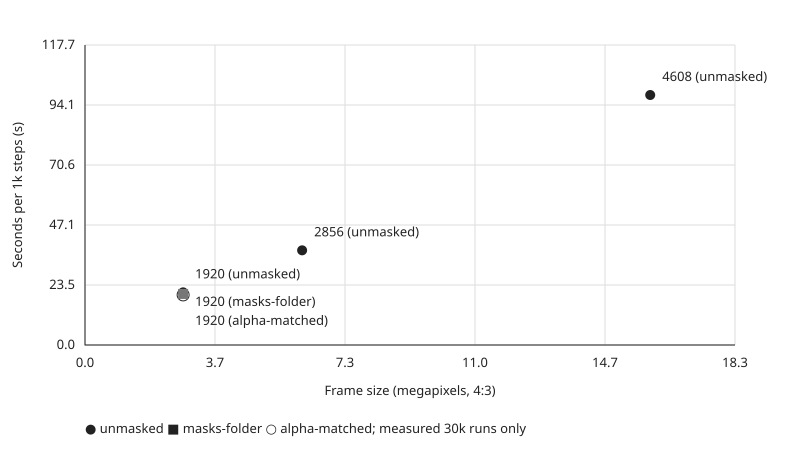

# Training results

Brush 0.3.0; seed 42; splat cap 1,500,000.

Frame pixels = max_res * (max_res * 3 / 4), assuming 4:3 frames; megapixels = pixels / 1,000,000.

## Resolution sweep

Cannon, unmasked, 30,000 steps. All table values are measured or calculated from records.

| Job | max_res (px) | Images | Megapixels | s / 1k steps | s / 1k / MP | Wall (s) | Splats | Peak RSS (MB) |
|---|---:|---:|---:|---:|---:|---:|---:|---:|
| 5ddf4dd587a1 | 1920 | 57 | 2.7648 | 20.65 | 7.47 | 619.5 | 1,500,000 | 2315.0 |
| bd4c58622f13 | 2856 | 57 | 6.1176 | 37.13 | 6.07 | 1114.0 | 1,500,000 | 2970.9 |
| ab7325928819 | 4608 | 57 | 15.9252 | 98.05 | 6.16 | 2941.4 | 1,500,000 | 4964.1 |

Per-megapixel cost is approximately flat from 2856 px upward; the cap binds at every resolution.

**Native-resolution extrapolation (not a measurement):** assuming 5712 * 4284 (24.4702 MP), the mean measured cost at ≥2856 px (6.1132 s / 1k / MP) predicts 149.59 s / 1k steps, or 4487.7 s (74.8 min) for 30k steps.
The target dimensions are an explicit assumption, absent from the job records; this linear projection does not measure native wall time or account for overhead changes.

## Masking A/B

Cannon, 1920 px, 30,000 steps.

Unmasked supervises the entire image, including the background.

Masks-folder zeroes loss outside the subject ("don't care"), leaving stray splats there unpunished.

Alpha-matched uses the mask as the RGBA alpha target ("render nothing here"), supervising transparency outside the subject.

| Arm | Job | Images | Wall (s) | Raw splats | Cleaned splats | Quantile | SOG (bytes) | Raw reduction | Cleaned reduction |
|---|---|---:|---:|---:|---:|---:|---:|---:|---:|
| unmasked | 5ddf4dd587a1 | 57 | 619.5 | 1,500,000 | 753,314 | 0.55 | 10,553,423 | 0.00% | 49.78% |
| masks-folder | f46e17da4620 | 57 | 600.5 | 358,785 | 204,482 | 0.55 | 2,944,730 | 76.08% | 86.37% |
| alpha-matched | b1c5b2ee634a | 56 | 589.6 | 177,579 | 159,755 | 0.9 | 2,248,387 | 88.16% | 89.35% |

Both reduction columns use the unmasked raw baseline (1,500,000 splats): 100 * (1 - count / baseline). SOG sizes are recorded exports, not estimates; unavailable means not recorded.

Image counts differ for the alpha arm; cleaning quantiles also differ, so cleaned counts are not a controlled comparison of supervision alone. Smaller raw scenes plus cleaning and SOG packing yield smaller deliveries; these records do not establish visual quality or a compression ratio by themselves.

## Probes

Short runs only; excluded from the 30k comparisons and chart.

| Job | Subject | Arm | Steps | max_res (px) | Images | s / 1k steps | Wall (s) | Splats | Peak RSS (MB) |
|---|---|---|---:|---:|---:|---:|---:|---:|---:|
| e6eacab11be5 | cannon | unmasked | 3,000 | 4608 | 57 | 96.94 | 290.8 | 35,547 | 4947.1 |

---

Generated by `tools/results_table.py` from `docs/results/runs.json` and `docs/results/jobs/<job-id>.json` (job IDs above identify each source).
Generated at: 2026-09-04 20:35:25 UTC
